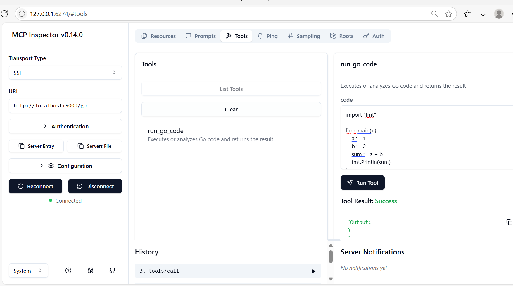

# mcp-example-go-code

**this is just a demo code for running Go code in MCP (Model Context Protocol) way.
and it has the risk of running arbitrary code, so please use it with caution.**

a simple MCP server demo code for running go code in MCP way 

the go code is passed to the MCP server, which then executes it and returns the result.

## prerequisites

make sure you already have the following tools installed:
- [go](https://golang.org/doc/install/source)
- [python](https://www.python.org/downloads/)
    
## setup

```bash

# prerequisites
# verify golang and python are installed
go version
python3 --version

# 1. clone the repo

git clone github.com:extraintelligen/mcp-example-go-code.git 

# 2. change directory to the repo
cd mcp-example-go-code

# 3. create a virtual environment
python3 -m venv .venv
# or install uv first and use `uv venv` to create a virtual environment 

# 4. activate the virtual environment
source .venv/bin/activate

# 5. install uv for dependencies management
pip install uv
# or install directly
curl -LsSf https://astral.sh/uv/install.sh | sh

# 6. install the dependencies
uv pip sync requirements.txt
```

## try with unittest

```bash     
# run the unittest 
python -m unittest tests/test_go_code_run.py
# or use uv to run the unittest
uv run -m unittest tests/test_go_code_run.py
```

## debug with MCP inspector

```bash
# use npx to run the MCP inspector, or try other ways to run MCP inspector
# verify that npx is installed
```bash
npx --version

# steps to install npx
# use nvm to install npx 
# refer to https://github.com/nvm-sh/nvm to install nvm
# use lts version
nvm use --lts

# run the MCP inspector
npx @modelcontextprotocol/inspector
# the inspector will start at localhost:6274 by default

# start the MCP server
python goCodeMcpServer/go_mcp_server.py --port 5000
# the port parameter is optional, default is 8000

```

open the browser and go to http://localhost:6274,
you will see the MCP inspector UI running at port 6274.

choose tranport type as "SSE"
and enter the MCP server URL as "http://localhost:5000/go (or any port and path you choose)".

Click "Connect"
click the "Tools" tab, then click "list tools" button, you should see the list of tools
choose the "run_go_code" tool, fill in the code to run, for example:

```go
package main
import "fmt"

func main() {
    fmt.Println("Hello, World!")
}
```
and click "Run Tools"
you will see the result 




